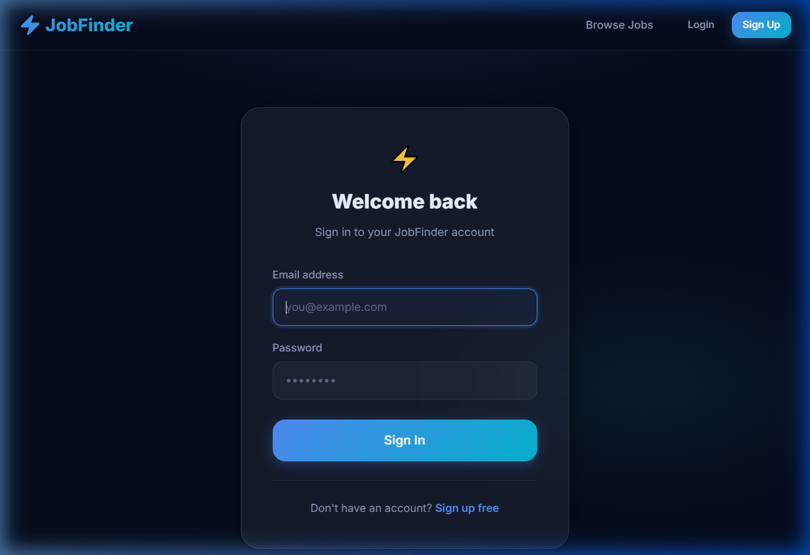
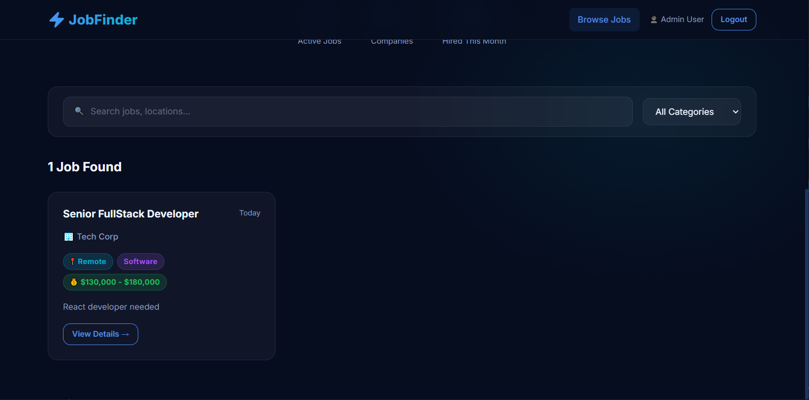
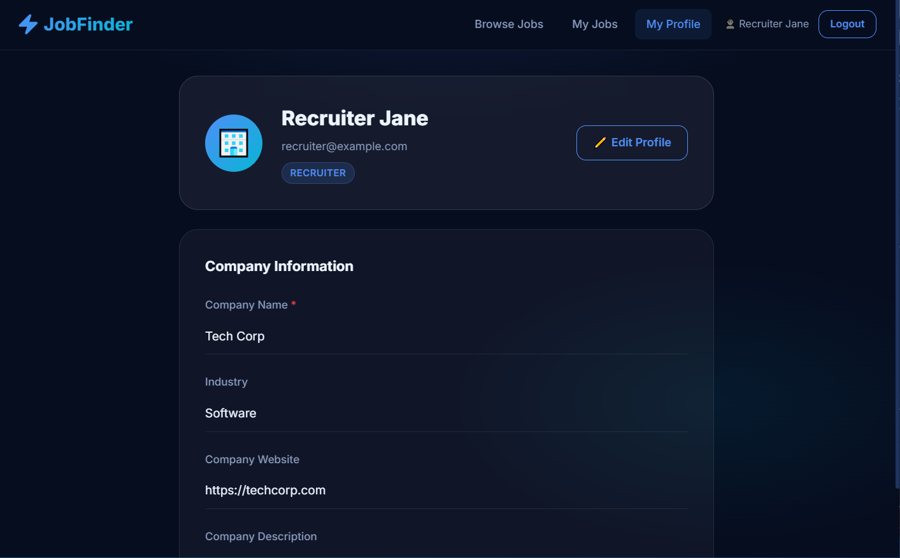
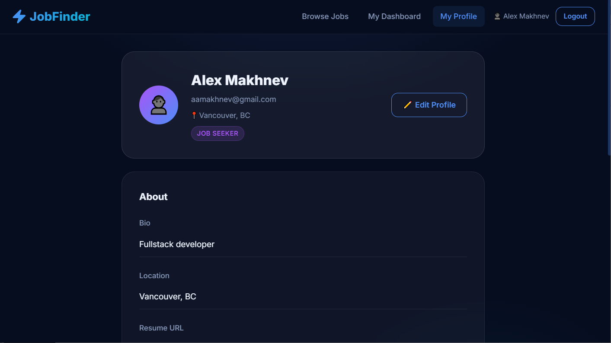

# ⚡ Job Finder — Frontend

A React 19 + TypeScript single-page application for the Job Finder platform. Features role-based dashboards for Job Seekers and Recruiters, **dual HTTP-only cookie auth** with silent token refresh, server-side paginated job search, profile management, and an **async job application workflow** backed by a Redis/Bull message queue — all wrapped in a premium dark-mode UI.

---

## 🔀 Alternative State-Management Implementations

This repository has **three branches**, each demonstrating a different global state-management strategy with the same feature set and UI.

| Branch | State Management | Link |
|--------|-----------------|------|
| `main` (this branch) | React Context + local `useState` hooks | — |
| `Zustand-Implementation` | Zustand stores | [View branch →](https://github.com/alexfromural-lgtm/job-finder-react/tree/Zustand-Implementation) |
| `Redux-Implementation` | Redux Toolkit (slices + thunks) | [View branch →](https://github.com/alexfromural-lgtm/job-finder-react/tree/Redux-Implementation) |

---

### 📂 Structure Difference — `main` vs `Zustand-Implementation`

The Zustand branch replaces `src/context/` with a dedicated `src/store/` directory containing modular Zustand stores. The hooks layer becomes a thin orchestration wrapper instead of owning state directly.

```diff
 src/
-├── context/
-│   └── AuthContext.tsx          # React Context — user state, session restore, signup actions
+├── store/
+│   ├── useAuthStore/
+│   │   ├── index.ts             # Re-exports the composed Zustand auth store
+│   │   ├── authState.ts         # AuthState interface + initial state
+│   │   ├── authActions.ts       # login, logout, signup*, getMe actions
+│   │   └── authStore.ts         # create() call — wires state + actions
+│   └── useJobSearchStore/
+│       ├── index.ts             # Re-exports the composed Zustand job-search store
+│       ├── jobSearchState.ts    # JobSearchState interface + initial state
+│       ├── jobSearchActions.ts  # setSearch, setCategory, fetchJobs… actions
+│       └── jobSearchStore.ts    # create() call — wires state + actions
 ├── hooks/
-│   ├── useJobSearch.ts          # Owns server-side search state (debounce, pagination, URL sync)
+│   ├── useJobSearch.ts          # Thin orchestrator: reads from useJobSearchStore, syncs URL
     └── …                        # Generic primitives unchanged (useDebounce, usePagination, …)
 └── …                            # All pages/components updated to call store selectors directly
```

> **Key difference:** Components that previously consumed `AuthContext` via `useContext` now call granular Zustand selectors (e.g. `useAuthStore(s => s.user)`), avoiding full-tree re-renders on unrelated state changes.

---

### 📂 Structure Difference — `main` vs `Redux-Implementation`

The Redux branch builds on the Zustand branch's module layout but replaces Zustand with Redux Toolkit. It introduces a central store, typed slices, async thunks, and selector files.

```diff
 src/
-├── context/
-│   └── AuthContext.tsx          # React Context — user state, session restore, signup actions
+├── store/
+│   ├── store.ts                 # configureStore() — combines all slice reducers; exports
+│   │                            #   RootState and AppDispatch types
+│   ├── slices/
+│   │   ├── authSlice/
+│   │   │   ├── index.ts         # Re-exports reducer + actions + thunks
+│   │   │   ├── authTypes.ts     # AuthState interface
+│   │   │   ├── authThunks.ts    # createAsyncThunk — loginThunk, logoutThunk, getMeThunk, …
+│   │   │   └── authSlice.ts     # createSlice() — reducers, extraReducers for thunks
+│   │   └── jobSearchSlice/
+│   │       ├── index.ts         # Re-exports reducer + actions + thunks
+│   │       ├── jobSearchTypes.ts  # JobSearchState interface
+│   │       ├── jobSearchThunks.ts # createAsyncThunk — fetchJobsThunk
+│   │       └── jobSearchSlice.ts  # createSlice() — reducers, extraReducers for thunks
+│   └── selectors/
+│       ├── authSelectors.ts     # Typed memoised selectors for auth state
+│       └── jobSearchSelectors.ts # Typed memoised selectors for job-search state
 ├── hooks/
-│   ├── useJobSearch.ts          # Owns server-side search state (debounce, pagination, URL sync)
+│   ├── useJobSearch.ts          # Dispatches fetchJobsThunk; reads state via selectors
     └── …                        # Generic primitives unchanged (useDebounce, usePagination, …)
+├── main.tsx                     # Wraps <App /> in Redux <Provider store={store}>
 └── …                            # All pages/components updated to useSelector / useDispatch
```

> **Key difference from Zustand branch:** State mutations go through dispatched actions and async thunks; components read state via typed selectors; the Redux DevTools extension gives full time-travel debugging.

---

## 📸 Screenshots

### Landing Page


### Login Page


### Signup Page (tab-based role selector)


### Job List (after login as Admin)


### Job List (after login as Recruiter)


### Job List (after login as JobSeeker)


### Recruiter Profile


### Job Seeker Profile


### Job Seeker Profile (continued)


### Job Seeker — My Applications


---

## 🛠 Tech Stack

| Technology | Version | Purpose |
|------------|---------|---------| 
| React | 19 | UI library |
| TypeScript | ~5.8 | Type safety |
| Vite | 7+ | Dev server & bundler |
| TailwindCSS | v4 | Utility CSS (via `@tailwindcss/vite`) |
| react-router-dom | v7 | Client-side routing + URL state |
| axios | ^1.16 | HTTP client with request/response interceptors |

---

## 🏗 Project Structure

```
src/
├── api/
│   ├── axiosClient.ts        # Base axios instance + auth interceptors (silent refresh)
│   │                         #   VITE_API_BASE_URL env override + 10 s request timeout (NEW)
│   ├── auth.api.ts           # signup, login, logout, getMe, refreshToken
│   ├── jobs.api.ts           # searchJobs (paginated), getAllJobs, getJobById, CRUD
│   ├── profile.api.ts        # get/update recruiter & job-seeker profiles
│   ├── applications.api.ts   # applyToJob (enqueue), getMyApplications, withdrawApplication
│   └── queue.api.ts          # getQueueJobStatus, pollUntilDone helper
├── context/
│   └── AuthContext.tsx       # User state, cookie-based session restore, hasRole(),
│                             #   signupJobSeeker(), signupRecruiter() actions (NEW)
├── hooks/
│   ├── useDebounce.ts        # Generic — debounces any value T for N ms
│   ├── usePagination.ts      # Generic — page math, getPageSlice<T>, owns PAGE_SIZES
│   ├── useInfiniteScroll.ts  # Generic — visible-count, loadMore, getVisibleSlice<T>
│   ├── useUrlSync.ts         # Generic — syncs any flat string map → URL search params
│   ├── usePaginatedJobs.ts   # Job-specific orchestrator composing the four hooks above
│   ├── useJobSearch.ts       # Server-side search wrapper (debounced) — updated signature
│   ├── usePageTitle.ts       # Sets document.title with app-name suffix (NEW)
│   └── useQueueStatus.ts     # Polls /queue/job/:id until terminal state (NEW)
├── types/
│   └── index.ts              # TypeScript interfaces — SavedJob, QueueJobStatus,
│                             #   QueueJobResponse, JobSeekerSignupRequest,
│                             #   RecruiterSignupRequest added (NEW)
├── utils/
│   └── apiError.ts           # extractApiError() — typed axios error → human string (NEW)
├── components/
│   ├── ErrorBoundary.tsx     # Class component — catches render errors, shows fallback (NEW)
│   ├── ui/                   # Button, Input, Card, Badge, Modal, Pagination
│   ├── layout/               # Navbar, ProtectedRoute
│   ├── landing/              # LandingHero, LandingJobListings
│   └── jobs/                 # JobCard, JobList, JobForm, JobFilterBar,
│                             # JobDetailHeader, JobDetailBody, JobDetailSection,
│                             # JobDetailCTA, ApplyModal, ApplicationsList
└── pages/
    ├── LandingPage.tsx               # Public — browse & filter jobs (paginated)
    ├── LoginPage.tsx                 # Public — sign in (usePageTitle, extractApiError)
    ├── SignupPage.tsx                # Public — register via AuthContext signup actions
    ├── JobDetailPage.tsx             # Public — full job detail + Apply CTA
    ├── NotFoundPage.tsx              # 404 fallback route (NEW)
    ├── jobseeker/
    │   ├── DashboardPage.tsx         # Protected (JOB_SEEKER) — server-side search via
    │   │                             #   useJobSearch; category filter dropdown added
    │   ├── ProfilePage.tsx           # Protected (JOB_SEEKER) — view/edit profile
    │   ├── ApplicationsPage.tsx      # Protected (JOB_SEEKER) — my applications
    │   └── profile/                  # Profile sub-components
    │       ├── ProfileHeader.tsx     # Avatar, name, edit-mode toggle
    │       ├── AboutSection.tsx      # Bio & location fields
    │       ├── SkillsSection.tsx     # Skills tag list
    │       ├── SkillTagInput.tsx     # Tag input with add/remove
    │       ├── BackgroundSection.tsx # Education & experience fields
    │       ├── FieldRow.tsx          # Labelled field display/edit row
    │       └── ProfileAlerts.tsx     # Success / error alert banners
    └── recruiter/
        ├── DashboardPage.tsx         # Protected (RECRUITER) — CRUD job postings;
        │                             #   extractApiError, usePageTitle, personalised greeting
        └── ProfilePage.tsx           # Protected (RECRUITER) — view/edit profile
```

---

## 🔐 Auth Flow

Both the short-lived **access token** (15 min) and the long-lived **refresh token** (7 days) are stored exclusively as `HttpOnly; SameSite=Lax` cookies. JavaScript never sees either token value — this eliminates the entire class of XSS-based token theft.

1. **Signup / Login** → backend sets two HTTP-only cookies: `accessToken` and `refreshToken`. The response body contains only a status message.
2. Every request goes through `axiosClient` with `withCredentials: true` — the browser attaches both cookies automatically. No `Authorization` header is set.
3. On page reload, `AuthContext` calls `GET /api/auth/me` directly. The browser sends the `accessToken` cookie and the server returns the user profile to rehydrate the session.
4. **On any `401` response**, the axios response interceptor attempts a silent token refresh:
   - Calls `POST /api/auth/refresh` (sends the `refreshToken` cookie automatically).
   - On success: backend sets fresh cookies; the interceptor **retries the original request** — transparent to the caller.
   - On failure: dispatches `auth:unauthorized`, clears user state, and redirects to login.
5. `AuthContext` listens for the `auth:unauthorized` custom event to clear in-memory user state.
6. After a successful login or signup, users are redirected to their role-specific dashboard:
   - `RECRUITER` → `/dashboard/recruiter`
   - `JOB_SEEKER` → `/dashboard/seeker`

> The `_retry` flag on each request config ensures the refresh is only attempted **once per request**, and refresh calls are excluded from retry to prevent infinite loops.

### Signup via AuthContext

`AuthContext` now exposes `signupJobSeeker()` and `signupRecruiter()` actions. Each calls the API then immediately calls `getMe()` to hydrate user state, so the user is logged in right after signup without a separate request from the page component.

---

## 🌐 API Integration

All calls go through `axiosClient` with `baseURL: VITE_API_BASE_URL ?? '/api'` (Vite proxies `/api` → `http://localhost:5002`). A **10-second request timeout** is enforced; timed-out requests surface as `'Request timed out. Please try again.'` via `extractApiError`.

### Error handling

All `catch` blocks use `extractApiError(err, fallback)` from `src/utils/apiError.ts` instead of raw `err?.response?.data?.error` access:

```ts
import { extractApiError } from '../utils/apiError';
// …
} catch (err) {
  setError(extractApiError(err, 'Failed to load jobs.'));
}
```

It prefers the structured `{ "error": "…" }` field returned by the backend, then falls back to network/timeout messages, then the supplied fallback string.

### Auth

| Method | Endpoint | Auth | Usage |
|--------|----------|------|-------|
| `POST` | `/auth/signup/jobseeker` | — | Job Seeker registration |
| `POST` | `/auth/signup/recruiter` | — | Recruiter registration |
| `POST` | `/auth/login` | — | Login; sets `accessToken` + `refreshToken` cookies |
| `POST` | `/auth/logout` | — | Clears both cookies |
| `POST` | `/auth/refresh` | Cookie | Silent token refresh (called by interceptor on 401) |
| `GET`  | `/auth/me` | Cookie | Restore session on reload |

### Jobs

| Method | Endpoint | Auth | Usage |
|--------|----------|------|-------|
| `GET`  | `/jobs/all` | — | Paginated + filtered job listing |
| `GET`  | `/jobs/:id` | — | Job detail page |
| `GET`  | `/jobs/recruiter` | `RECRUITER` | Recruiter's own job listings |
| `POST` | `/jobs` | `RECRUITER` | Create job |
| `PUT`  | `/jobs/:id` | `RECRUITER` | Update job |
| `DELETE` | `/jobs/:id` | `RECRUITER` | Delete job |

### Profiles

| Method | Endpoint | Auth | Usage |
|--------|----------|------|-------|
| `GET`  | `/recruiter/profile` | `RECRUITER` | Get recruiter profile |
| `PATCH` | `/recruiter/profile` | `RECRUITER` | Update recruiter profile |
| `GET`  | `/jobseeker/profile` | `JOB_SEEKER` | Get job seeker profile |
| `PATCH` | `/jobseeker/profile` | `JOB_SEEKER` | Update job seeker profile |

All profile responses now use the `{ data: … }` envelope — `profile.api.ts` reads `res.data`.

### Applications

| Method | Endpoint | Auth | Usage |
|--------|----------|------|-------|
| `POST` | `/jobseeker/apply/:jobId` | `JOB_SEEKER` | Enqueue application — returns `202` + `{ jobId }` |
| `GET`  | `/jobseeker/applications` | `JOB_SEEKER` | List my applications (supports `AbortSignal`) |
| `DELETE` | `/jobseeker/applications/:id` | `JOB_SEEKER` | Withdraw application |

### Queue

| Method | Endpoint | Auth | Usage |
|--------|----------|------|-------|
| `GET` | `/queue/job/:jobId` | — | Poll status of a queued write (apply / save-job) |

---

## 🔑 Role-Based Routing

| Path | Component | Guard |
|------|-----------|-------|
| `/` | `LandingPage` | Public |
| `/login` | `LoginPage` | Public |
| `/signup` | `SignupPage` | Public |
| `/jobs/:id` | `JobDetailPage` | Public |
| `/dashboard/seeker` | `JobSeekerDashboard` | `JOB_SEEKER` required |
| `/dashboard/seeker/applications` | `ApplicationsPage` | `JOB_SEEKER` required |
| `/profile/seeker` | `JobSeekerProfilePage` | `JOB_SEEKER` required |
| `/dashboard/recruiter` | `RecruiterDashboard` | `RECRUITER` required |
| `/profile/recruiter` | `RecruiterProfilePage` | `RECRUITER` required |
| `*` | `NotFoundPage` | Public (catch-all) |

`ProtectedRoute` redirects unauthenticated users to `/login` and users without the required role to `/`.

---

## 📬 Async Apply Flow

Applying to a job is fully asynchronous to keep the UI responsive under high load:

1. **`ApplyModal` submits** → `POST /api/jobseeker/apply/:jobId` — backend responds `202 Accepted` with a Bull `jobId`.
2. **Modal polls** → `GET /api/queue/job/:jobId` every 600 ms (via `pollUntilDone` in `queue.api.ts`) until the status is `completed` or `failed`, or 30 s elapses.
3. **On `completed`** — the `result` field contains the created `Application` object; the modal surfaces a success message and calls `onSuccess(application.id)`.
4. **On `failed`** — the `failedReason` is shown to the user as an error.
5. **AbortController** is used to cancel in-flight polling when the modal closes or the component unmounts.

```
apply click → POST /apply/:jobId → 202 { jobId }
  └─ poll GET /queue/job/:jobId (600 ms interval, 30 s max)
        ├─ status: waiting/active → keep polling
        ├─ status: completed → show success, call onSuccess()
        └─ status: failed → show error, re-enable form
```

For components that only need to observe a queue job started elsewhere, use the `useQueueStatus(queueJobId)` hook — it polls at 1500 ms intervals and returns `{ status, result, error, isLoading }`.

---

## 🪝 Hooks

All custom hooks live in `src/hooks/`. The layer is split into four **generic primitives** (no domain dependency) and one **job-specific orchestrator**, plus new utility hooks.

### Generic primitives

| Hook | Signature | Responsibility |
|------|-----------|----------------|
| `useDebounce` | `<T>(value: T, delayMs?)` | Returns a debounced copy of any value; cleans up the timer on unmount |
| `usePagination` | `({ totalItems, initialPage?, initialPageSize? })` | Page math, `getPageSlice<T>`, owns `PAGE_SIZES = [10, 25, 50]` |
| `useInfiniteScroll` | `({ totalItems, pageSize, initialVisible? })` | Manages `visibleCount`, exposes `loadMore` and `getVisibleSlice<T>` |
| `useUrlSync` | `(params: Record<string, string \| undefined>)` | Writes any flat param map to URL search string (replace mode); omits empty keys |

### Job-specific orchestrator

**`usePaginatedJobs`** — the only hook that imports `Job`. It composes the four primitives:

```
usePaginatedJobs
  ├─ useDebounce        (debounced search input)
  ├─ usePagination      (page math + slicing)
  ├─ useInfiniteScroll  (scroll-mode visible window)
  └─ useUrlSync         (search / category / page / pageSize → URL)
```

The filter predicate is **injectable** via a `filterFn` option (Dependency Inversion), with a sensible default that matches title, location, and description.

### New utility hooks

| Hook | Purpose |
|------|---------|
| `usePageTitle(title)` | Sets `document.title` to `"<title> \| Job Finder"` and restores the previous value on unmount |
| `useQueueStatus(queueJobId)` | Polls `GET /queue/job/:id` at 1500 ms until `completed` or `failed`; returns `{ status, result, error, isLoading }` |

### SOLID alignment

| Principle | How it's applied |
|-----------|-----------------|
| **SRP** | Each primitive owns exactly one concern (debounce / page math / scroll state / URL sync) |
| **OCP** | Pass a custom `filterFn` to extend filtering without touching hook internals |
| **ISP** | Generic hooks expose only what they own; consumers pull only what they need |
| **DIP** | `usePaginatedJobs` depends on the `JobFilterFn` abstraction, not a concrete field list |

---

## 🔍 Search, Pagination & Infinite Scroll

The `useJobSearch` hook (used on the Job Seeker Dashboard) provides server-side search:

- **Debounced search** (300 ms) — passed server-side to `GET /jobs/all`.
- **Category filter** — dropdown populated from distinct categories in results.
- **Configurable page sizes** — `10 / 25 / 50` items per page.
- **Infinite-scroll mode** — toggle to replace classic pagination with "Load More".
- **URL state persistence** — `search`, `category`, `page`, and `pageSize` are synced to query params so filters survive navigation and sharing.

For the Landing Page, `searchJobs()` additionally passes params server-side to `GET /jobs/all`, enabling server-driven pagination and reducing client-side data transfer.

---

## 🧱 Error Boundary

`src/components/ErrorBoundary.tsx` wraps the entire app in `src/main.tsx`:

```tsx
<ErrorBoundary>
  <AuthProvider>
    <App />
  </AuthProvider>
</ErrorBoundary>
```

- Catches unhandled render errors and displays a styled fallback ("Something went wrong") instead of a blank screen.
- In development (`import.meta.env.DEV`), shows the raw error message for easier debugging.
- Accepts an optional `fallback` prop for per-subtree customisation.

---

## ⚙️ Development

### Prerequisites
- Node.js 18+
- The backend must be running on port 5002 (see [`../job-finder-backend-customized`](../job-finder-backend-customized))

### Install & run

```bash
cd job-finder-react-customized
npm install
npm run dev
# Dev server: http://localhost:3000
# /api requests proxied → http://localhost:5002
```

### Environment variables (optional)

```env
VITE_API_BASE_URL=/api   # override the axios base URL (defaults to /api via Vite proxy)
```

### Lint

```bash
npm run lint
```

### Build for production

```bash
npm run build   # TypeScript check + Vite bundle → dist/
npm run preview # Preview the production build locally
```

---

## 🧩 Key Types (`src/types/index.ts`)

```ts
type Role = 'JOB_SEEKER' | 'RECRUITER' | 'ADMIN';
type ApplicationStatus = 'submitted' | 'shortlisted' | 'under_review' | 'rejected';
type QueueJobStatus = 'waiting' | 'active' | 'completed' | 'failed' | 'delayed' | 'paused';

interface User {
  id: string; name: string; email: string;
  roles: Role[]; isActive: boolean;
  createdAt: string; updatedAt: string;
}

interface JobSeekerProfile {
  id: string; userId: string;
  bio?: string; location?: string; skills: string[];
  education?: string; experience?: string; resumeUrl?: string;
  user?: Pick<User, 'id' | 'name' | 'email'>;
}

interface RecruiterProfile {
  id: string; userId: string;
  companyName: string; companyWebsite?: string;
  description?: string; industry?: string;
  user?: Pick<User, 'id' | 'name' | 'email'>;
}

interface Job {
  id: string; recruiterId: string; title: string;
  description: string; requirements: string; location: string;
  salaryRange?: string; category?: string; isActive: boolean;
  createdAt: string; updatedAt: string;
  recruiter?: { companyName: string; industry?: string; companyWebsite?: string };
}

interface Application {
  id: string; jobId: string; jobSeekerId: string;
  coverLetter?: string; status: ApplicationStatus;
  createdAt: string; updatedAt: string;
  job?: { id: string; title: string; location: string;
          salaryRange?: string; category?: string;
          recruiter?: { companyName: string } };
}

interface SavedJob {        // NEW
  id: string; jobId: string; jobSeekerId: string; savedAt: string;
  job?: { id: string; title: string; location: string;
          salaryRange?: string; category?: string; isActive: boolean;
          recruiter?: { companyName: string } };
}

interface QueueJobResponse {  // NEW
  id: string | number; type: string; status: QueueJobStatus;
  attemptsMade: number; createdAt: string;
  result?: unknown; failedReason?: string;
}
```

---

## 🔗 Backend

API source: [`../job-finder-backend-customized`](../job-finder-backend-customized) — Express / Prisma / PostgreSQL running on **port 5002**.
